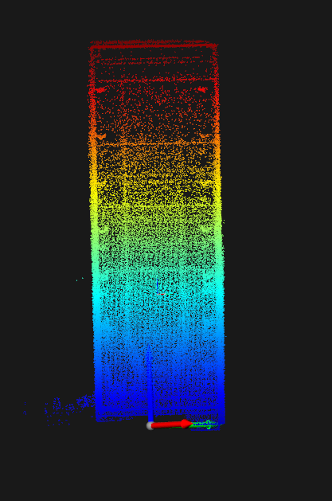
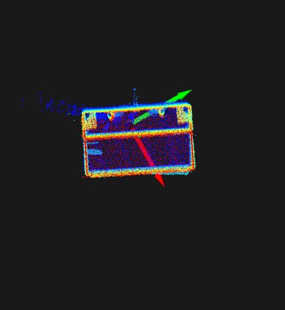
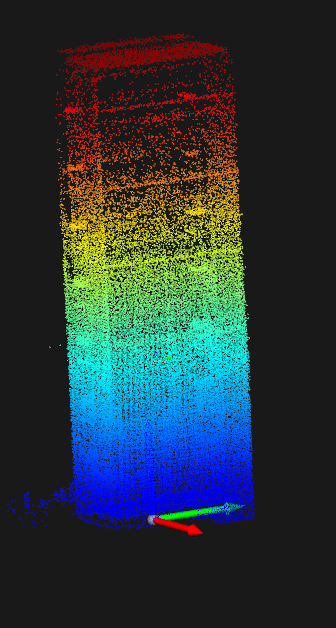
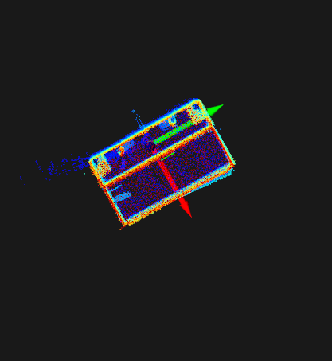
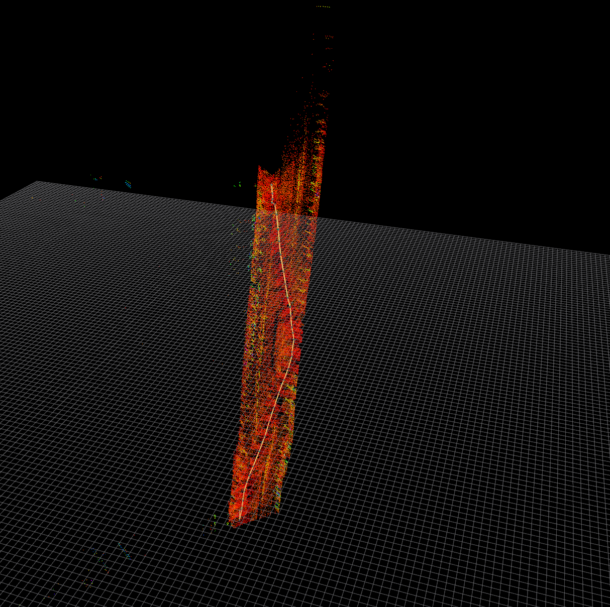
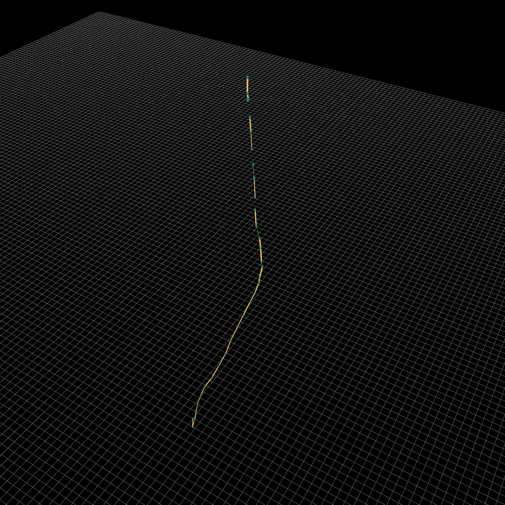
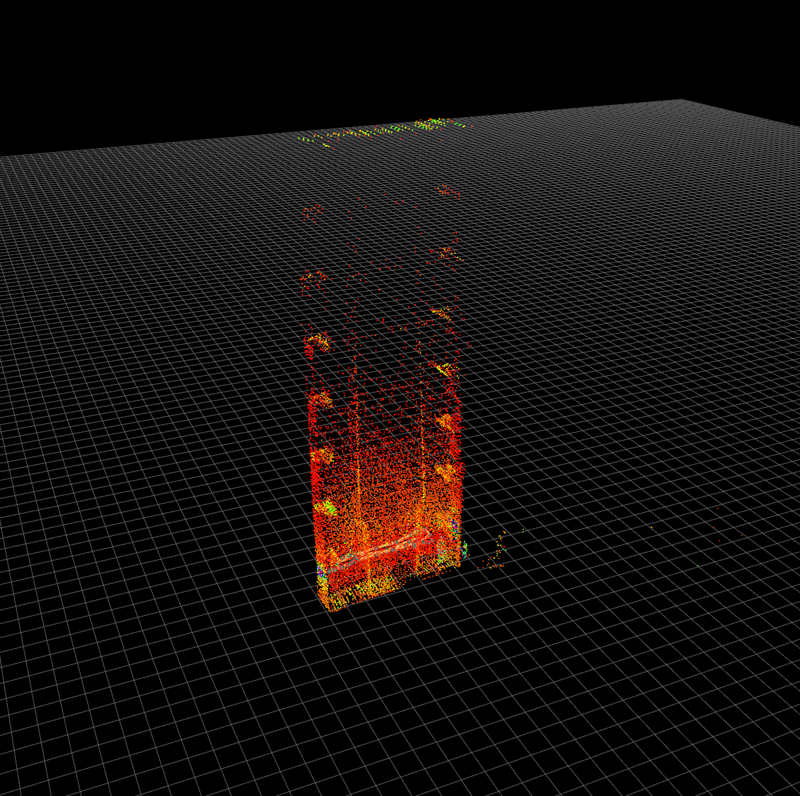

# Localization at HRSG Manhole

## Perception Pipeline

1. (offline) **COLLECT LiDAR and IMU data**, sweeping inside each manhole: field experiments
2. (offline) **BUILD MAP** and postprocess:
   1. identify the floor and level the map
   <p float="left">
     
     
   </p>
   2. manually rotate the map (yaw) so that axes are aligned (parallel) to the real world
   <p float="left">
     
     
   </p>
3. while building map, **construct NODE GRAPH**
   1. node: important (key) pose
   2. which involves LiDAR-inertial odometry (LIO) internally
4. (online) **LOCALIZE** drone
   1. initially by providing **INITIAL POSE**: where drone takes off (depends on the experiment), probably where **station** should be
   2. then consecutively:
      1. by identifying similar & revisited node (constructed offline, see 3)
      2. and applying LIO & fixed window smoothing (factor graph optimization)

## Problems of HRSG Manholes

there were two problems:

1. while building map, internal LIO continuously failed

   - correspondence are hard to secured, due to the repeated feature
     - **correspondence**: where are the points (of current LiDAR scan) mapped to the built map?
   - basically **tunnel-like & featureless** structures are harsh environment for LIO

   - an example of problematic map: 

2. identifying node(s) and initial pose

   - basically all nodes are similar
   - the manhole structure was narrow and repeated, thus, there are many (multimodal) wrong localization solutions

   - an example of node graph under ill-conditioned situation (where no vertical movements were involved in real world): 

## Solution Approaches

respective approach per problem is:

1. relax the correspondence checking condition

   - there are basically tons of parameters:

   - ```yaml
     /**:
       ros__parameters:
         bag_file: "" # absolute path of bagfile
         odometry_type: "fast_lio"
         keyframe_detection:
           max_range: 40.0 # maximum detection range
           max_time_diff: 60.0 # maximum time difference to maintain the latest keyframe
           motion_threshold: 5.0 # motion triggered keyframe generation
         loop_detection:
           nearby_frames: 3 # nearby keyframes to loop registration
           search_radius: 1.5 # search radius for loop candidate
           min_time_diff: 30.0 # minimum time difference to be a loop pair
           registration:
             resolution: 0.125 # loop registration sampling resolution
             max_iterations: 20 # maximum iteration
             k_corrs: 10 # nearest k
             kernel_sigma: 1.0 # m-estimator constant
             convergence_epsilon: 0.001 # convergence criterion
         graph_optimization:
           max_iterations: 10 # maximum iteration
           abs_error_epsilon: 0.000001 # absolute residual epsilon
           rel_error_epsilon: 0.000001 # relative residual epsilon
           prior_orientation_noise_sigma: 0.000001 # rotational noise sigma for prior factor
           prior_position_noise_sigma: 0.000001 # translational noise sigma for prior factor
           odom_rotation_noise_sigma: 0.001 # rotational noise sigma for odometry factor
           odom_translation_noise_sigma: 0.01 # translational noise sigma for odometry factor
           loop_rotation_noise_sigma: 0.003 # rotational noise sigma for loop factor
           loop_translation_noise_sigma: 0.03 # translational noise sigma for loop factor

         base_frame: "ids" # body frame name
         map_size: 100.0 # edge length of local map
         init_period: 0.5 # system initialization period
         gravity_scale: 9.81 # scale of gravity vector
         base_to_lidar: # base-to-lidar extrinsic params (for visualization)
           rotation: [1.0, 0.0, 0.0, 0.0, 1.0, 0.0, 0.0, 0.0, 1.0]
           translation: [0.0, 0.0, 0.0]
         imu_to_lidar: # imu-to-lidar extrinsic params
           rotation: [1.0, 0.0, 0.0, 0.0, 1.0, 0.0, 0.0, 0.0, 1.0]
           translation: [0.0, 0.0, 0.0]
           fixed: true
         preprocess:
           skip_stride: 2 # resampling stride
           resolution: 0.125 # downsampling resolution
           range:
             min: 0.5 # nearest range
             max: 40.0 # farthest range
         registration:
           use_feature: true # use only planar neighbor points
           plane_threshold: 0.05 # planarity threshold
           k_corrs: 10 # nearest k to search neighbor points
           max_corr_dist: 1.0 # maximum correspondency distance
           min_corrs: 100 # minimum correspondency number
         ikd_tree:
           resolution: 0.25 # downsampling resolution
           alpha_deletion: 0.5
           alpha_balance: 0.7
           min_size_rebuild: 10 # minimum subtree size to rebuild
           min_size_async: 1500 # minimum subtree size to async worker
         ivox_map:
           resolution: 0.25 # downsampling resolution
           nearby_search: 4 # {1, EXACT}, {2, Nearby7}, {3, Nearby19}, {4, Nearby27}
           max_points_per_voxel: 5 # maximum points in single voxel
           max_decay: 60.0 # maximum decay time in seconds
         ikf:
           max_iterations: 4 # maximum iteration
           convergence_epsilon: 0.005 # convergence criterion
           lidar_noise_sigma: 0.03 # sigma of point noise distribution
           imu_noise_sigma: [0.01, 0.03, 0.0001, 0.0001] # [gyro, accel, bias_gyro, bias_accel]
     ```

   - by adjusting these parameters **PER-MANHOLE** :`loop_detection::registration::k_corrs`, `preprocess::resolution`, `registration::k_corrs`, `registration::resolution`, `ikd_tree::resolution`, successful maps were obtained
   - an example for manhole 6 (with node graph) would be: 
   - yet, no consistent parameters were found that universally apply for all manholes: different manhole should use different set of parameters

2. fine-tune the parameters related to LIO and (re)localization

   - however, still not solved: unstable solution
   - a different set of parameters set is used here:
   - ```yaml
      map_path: "/home/junwoo/ids_mmu_workspace/src/perception/navigation/assets/mh6_rev"
     keyframe_detection:
         max_range: 30.0            # maximum detection range
         max_time_diff: 30.0        # maximum time difference to maintain the latest keyframe
         motion_threshold: 5.0      # motion triggered keyframe generation
     relocalization:
         period: 10.0
         search_radius: 5.0
         registration:
             num_threads: 1
             resolution: 0.25            # loop registration sampling resolution
             max_iterations: 64          # maximum iteration
             k_corrs: 5                  # nearest k
             kernel_sigma: 1.0           # m-estimator constant
             convergence_epsilon: 0.001  # convergence criterion
     fixed_lag_smoother:
         window_size: 30.0                 # smoother lag in seconds
         prior_orientation_noise_sigma: 0.01  # rotational noise sigma for prior factor
         prior_position_noise_sigma: 0.1      # translational noise sigma for prior factor
         odom_rotation_noise_sigma: 0.001     # rotational noise sigma for odom factor
         odom_translation_noise_sigma: 0.01   # translational noise sigma for odom factor
         relo_rotation_noise_sigma: 0.003     # rotational noise sigma for relo factor
         relo_translation_noise_sigma: 0.03   # translational noise sigma for relo factor
     lidar_topic: "/livox/lidar"  # point cloud topic
     imu_topic: "/livox/imu"      # imu topic
     base_frame: "ids"              # base frame
     num_threads: 5                 # maximum number of threads for tbb
     map_size: 100.0                # edge length of local map
     init_period: 0.5               # system initialization period
     gravity_scale: 9.81            # scale of gravity vector
     base_to_lidar:                 # base-to-lidar extrinsic params (for visualization)
         rotation: [  1.0,  0.0,  0.0,
                      0.0,  1.0,  0.0,
                      0.0,  0.0,  1.0 ]
         translation: [ 0.0, 0.0,  0.0 ]
     imu_to_lidar:                  # imu-to-lidar extrinsic params
         rotation: [  1.0,  0.0,  0.0,
                      0.0,  1.0,  0.0,
                      0.0,  0.0,  1.0 ]
         translation: [ 0.0110, 0.02329, -0.04412 ]
         fixed: true
     preprocess:
         skip_stride: 1             # resampling stride
         resolution: 0.125           # downsampling resolution
         range:
             min: 0.5               # nearest range
             max: 40.0              # farthest range
     registration:
         use_feature: false          # use only planar neighbor points
         plane_threshold: 0.05      # planarity threshold
         k_corrs: 5                # nearest k to search neighbor points
         max_corr_dist: 10.0         # maximum correspondency distance
         min_corrs: 100             # minimum correspondency number
     ikd_tree:
         resolution: 0.25            # downsampling resolution
         alpha_deletion: 0.5
         alpha_balance: 0.7
         min_size_rebuild: 10       # minimum subtree size to rebuild
         min_size_async: 1500       # minimum subtree size to async worker
     ivox_map:
         resolution: 0.5            # downsampling resolution
         nearby_search: 4           # {1, EXACT}, {2, Nearby7}, {3, Nearby19}, {4, Nearby27}
         max_points_per_voxel: 5    # maximum points in single voxel
         max_decay: 30.0            # maximum decay time in seconds
     ikf:
         max_iterations: 4          # maximum iteration
         convergence_epsilon: 0.005 # convergence criterion
         lidar_noise_sigma: 0.05    # sigma of point noise distribution
         imu_noise_sigma: [ 0.03, 0.3, 0.001, 0.01 ] # [gyro, accel, bias_gyro, bias_accel]
     ```
   - by adjusting these parameters **PER-MANHOLE** :`relocalization::resolution`, `relocalization::k_corrs`, `ikd_tree::resolution`, `ikf::imu_noise_sigma`, `ikf::lidar_noise_sigma`, **ONLY FEW** cases were able to correctly estimate poses.
   - below are some examples of successful and failed cases (videos):
     - [successful](./localization_successful.mp4), [failed1](./localization_fail1.mp4), [failed2](./localization_fail2.mp4)
     - note: initial jump was intentional, by feeding true initial pose (by operator)
   - common feature of failure cases:
     - it seems to track correctly but out of sudden **the solution jumps** to other nodes that was accidently more fitted to current scan
     - repeated and hard-to-distinct feature of manhole yields **unstable** pose solution
     - **of course we can TRY FLYING drones**, but safety (stability of accurate solution) should be secured first
